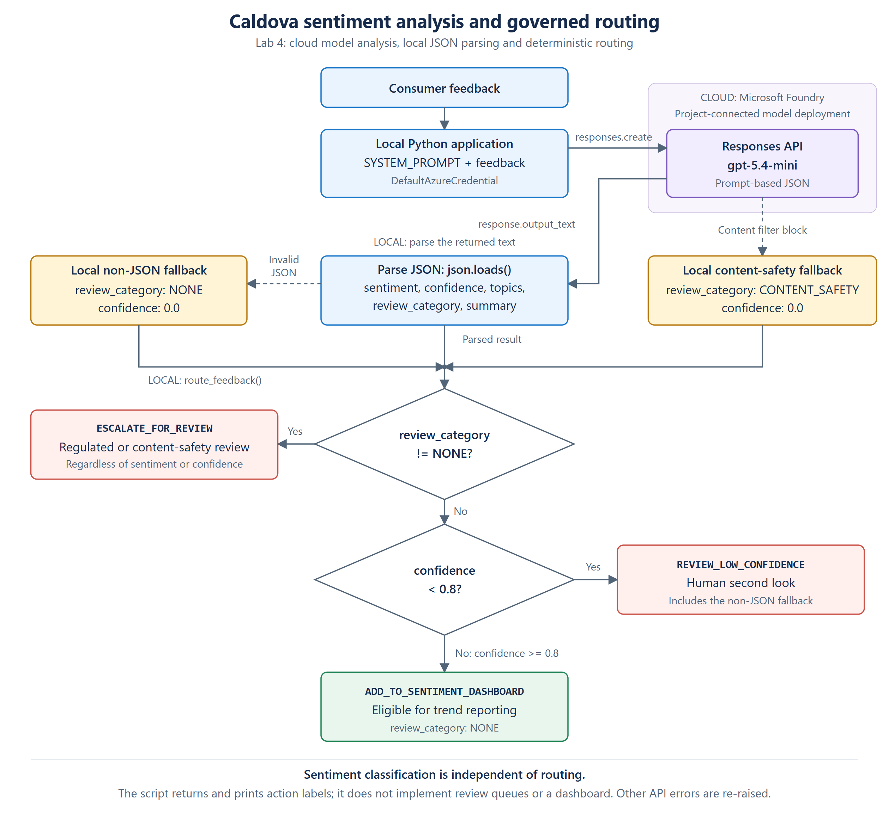

# Lab 4: Build Caldova's consumer sentiment analysis application

> **Duration:** ~20 minutes

## Objective

Build a working consumer sentiment analysis pipeline for Caldova's B2C engagement channels. The system accepts customer-submitted product reviews, classifies them using a Foundry-hosted model, applies moderation logic, and outputs structured results — ensuring that reviews from customers are safe and helpful before going live on the site.

## The problem

Caldova's B2C channels receive thousands of pieces of consumer feedback daily about products such as allergy relief tablets and topical relief gel, plus support interactions. Manual review does not scale. You need an automated system that can:

1. Accept consumer feedback as input.
2. Classify its sentiment (positive, neutral, negative, or mixed) and topics.
3. Independently identify regulated signals that require human review.
4. Return a structured decision with an evidence-based summary.
5. Handle edge cases gracefully.

Sentiment classification and regulated routing are **independent** of each other -- a POSITIVE piece of feedback can still contain a potential adverse event, and a NEGATIVE piece of feedback might simply reflect a delivery delay with no regulated content at all.

## Architecture



[Editable diagram source](images/architecture.svg). The model runs in Foundry; JSON parsing and routing run in the local Python application. A content filter block produces `CONTENT_SAFETY` with confidence `0.0` and is escalated. Invalid JSON instead produces `NONE` with confidence `0.0` and is routed to `REVIEW_LOW_CONFIDENCE`. The script returns and prints action labels; it does not implement review queues or a dashboard.

This pipeline uses **prompt-based JSON**: the system prompt instructs the model to respond only with valid JSON. For even stricter guarantees, OpenAI models support [Structured Outputs](https://platform.openai.com/docs/guides/structured-outputs), a `response_format` parameter that constrains the model to conform to a JSON schema. This lab uses the prompt-based approach for simplicity and portability across model providers.

## Step 1: Review the system prompt

The key to reliable sentiment analysis is a well-structured system prompt. Open `src/02_sentiment_analysis.py` and examine the `SYSTEM_PROMPT`:

```python
SYSTEM_PROMPT = """You are a consumer engagement insight analyst for Caldova, Microsoft's fictional global pharmaceutical company. Analyze feedback about Caldova products and support services.

Respond ONLY with valid JSON in this exact format:
{
    "sentiment": "<POSITIVE|NEUTRAL|NEGATIVE|MIXED>",
    "confidence": <0.0-1.0>,
    "topics": ["<PRODUCT_EXPERIENCE|PACKAGING|AVAILABILITY|SUPPORT|VALUE|OTHER>"],
    "review_category": "<NONE|POTENTIAL_ADVERSE_EVENT|PRODUCT_QUALITY_COMPLAINT|MEDICAL_INQUIRY|CONTENT_SAFETY>",
    "summary": "<brief evidence-based summary>"
}

Rules:
- Classify sentiment from the consumer's overall tone. MIXED means clearly positive and negative views are both present.
- POTENTIAL_ADVERSE_EVENT: an unwanted health effect or symptom is associated with use of a Caldova product.
- PRODUCT_QUALITY_COMPLAINT: a possible defect involving packaging, labeling, contamination, appearance, damage, or a delivery device.
- MEDICAL_INQUIRY: the consumer asks for diagnosis, dosing, interaction, treatment, or other personalized medical guidance.
- CONTENT_SAFETY: threats, hate, harassment, explicit content, or dangerous instructions.
- Use NONE when no review category applies.
- Do not determine causality, assess seriousness, or provide medical advice.
- When uncertain, lower confidence rather than inventing facts.

Do not include any text outside the JSON object."""
```

This prompt:

- **Constrains the output format** -- JSON only, predictable structure.
- **Separates two independent signals** -- sentiment (how the consumer feels) and review_category (whether the content needs regulated handling).
- **Provides classification rules** -- reduces ambiguity.
- **Explicitly limits the model's role** -- it must not determine causality, assess seriousness, or give medical advice; that stays with trained human reviewers.
- **Eliminates free-text noise** -- "Do not include any text outside the JSON object".

## Step 2: Understand the sentiment analysis pipeline

The application follows this flow:

### 2a. Send feedback for analysis

```python
def analyze_feedback(client, model: str, feedback: str) -> dict:
    """Send consumer feedback to the model and return structured insight."""
    try:
        response = client.responses.create(
            model=model,
            instructions=SYSTEM_PROMPT,
            input=feedback,
        )
    except Exception as exc:
        if "content_filter" in str(exc) or "content management policy" in str(exc):
            return {
                "sentiment": "MIXED",
                "confidence": 0.0,
                "topics": ["OTHER"],
                "review_category": "CONTENT_SAFETY",
                "summary": "Blocked by Azure content safety filtering.",
            }
        raise

    raw = response.output_text.strip()
    try:
        return json.loads(raw)
    except json.JSONDecodeError:
        return {
            "sentiment": "MIXED",
            "confidence": 0.0,
            "topics": ["OTHER"],
            "review_category": "NONE",
            "summary": f"Model returned non-JSON output: {raw[:100]}",
        }
```

Key design decisions:

| Decision | Rationale |
|----------|-----------|
| Separate instructions and input | Keeps classification rules distinct from consumer feedback |
| JSON output format | Machine-parseable, no regex needed |
| Structured system prompt | Reliable, consistent categorization |
| try/except around inference | Catches Azure content safety filter blocks gracefully |
| try/except around json.loads() | Falls back to NONE with confidence 0.0, resulting in REVIEW_LOW_CONFIDENCE, if the model returns malformed output |

### 2b. Apply governed routing logic

```python
def route_feedback(result: dict) -> str:
    """Route insights to analytics or an appropriate human review queue."""
    review_category = result.get("review_category", "NONE")
    confidence = result.get("confidence", 0.0)

    if review_category != "NONE":
        return "ESCALATE_FOR_REVIEW"
    if confidence < 0.8:
        return "REVIEW_LOW_CONFIDENCE"
    return "ADD_TO_SENTIMENT_DASHBOARD"
```

This adds a **business logic layer** on top of the model's analysis:

- Any regulated `review_category` (not `NONE`) → escalate for human review, regardless of sentiment or confidence.
- High-confidence, non-regulated feedback → add to the sentiment dashboard for trend reporting.
- Low-confidence, non-regulated feedback → route to a human for a second look.

Routing is driven entirely by `review_category` and `confidence` -- **never** by `sentiment`. A POSITIVE review can still be escalated (for example, positive feedback that also mentions a symptom).

### 2c. Process results

```python
def process_feedback(client, model: str, feedback: str) -> dict:
    """Analyze feedback, apply routing logic, and return the complete result."""
    analysis = analyze_feedback(client, model, feedback)
    return {
        "feedback": feedback,
        "sentiment": analysis.get("sentiment", "MIXED"),
        "confidence": analysis.get("confidence", 0.0),
        "topics": analysis.get("topics", ["OTHER"]),
        "review_category": analysis.get("review_category", "NONE"),
        "summary": analysis.get("summary", ""),
        "action": route_feedback(analysis),
    }
```

## Step 3: Run the application

Run the following command from the terminal:

```powershell
python src/02_sentiment_analysis.py
```

You should see output similar to the sample below. Since LLMs are non-deterministic, the output will not match 100%.

```text
========================================
  Caldova Consumer Sentiment Analysis
  Model: gpt-5.4-mini
========================================

Processing 5 sample feedback items...

--- Feedback 1/5 ---
Feedback: "The Caldova allergy relief tablets fit easily into my morning routine and the packaging is clear."
Sentiment: POSITIVE (confidence: 0.95)
Topics: PRODUCT_EXPERIENCE, PACKAGING
Review category: NONE
Summary: Consumer describes an easy, positive routine and clear packaging.
Action: 📊 ADD_TO_SENTIMENT_DASHBOARD

--- Feedback 4/5 ---
Feedback: "I felt dizzy after taking the Caldova allergy relief tablets."
Sentiment: NEGATIVE (confidence: 0.9)
Topics: PRODUCT_EXPERIENCE
Review category: POTENTIAL_ADVERSE_EVENT
Summary: Consumer reports dizziness after use; no causality determined.
Action: ⚠️ ESCALATE_FOR_REVIEW

========================================
  Engagement Insight Summary
========================================
Total feedback: 5
  POSITIVE:    1
  NEUTRAL:     0
  NEGATIVE:    2
  MIXED:       2
  ESCALATED:   2
```

> **Note:** Some feedback containing threats or explicit content may be blocked by Azure's built-in content safety filter *before* reaching the model. When this happens, the application handles it gracefully and labels the result with review_category CONTENT_SAFETY. This is expected behavior -- the content filter is an additional layer of protection in production deployments.

## Step 4: Test with custom feedback

The application also accepts interactive input. Run it with the `--interactive` flag:

```powershell
python src/02_sentiment_analysis.py --interactive
```

Type feedback to analyze it in real time:

```text
Enter feedback: What dose should I give my child?
Sentiment: NEUTRAL (confidence: 0.85)
Topics: PRODUCT_EXPERIENCE
Review category: MEDICAL_INQUIRY
Summary: Consumer asks for personalized dosing guidance.
Action: ⚠️ ESCALATE_FOR_REVIEW
```

Confirm that the application routes the medical inquiry for human review and does not provide medical advice. Type **quit** to exit.

## Step 5: Test with the sample dataset

The `src/sample_feedback.json` file contains a broader set of test feedback spanning positive, neutral, negative, mixed, adverse-event, product-quality, and medical-inquiry cases. Run the batch test:

```powershell
python src/02_sentiment_analysis.py --file src/sample_feedback.json
```

## Step 6: Customize the routing logic

Try adjusting the confidence threshold in the `route_feedback` function:

| Threshold change | Effect |
|-----------------|--------|
| Lower the confidence threshold (0.8 → 0.6) | More feedback goes straight to the dashboard |
| Raise the confidence threshold (0.8 → 0.9) | More feedback routed for a low-confidence human check |
| Add a new topic-based routing rule | Custom handling for a specific topic, such as VALUE |

After each change, re-run the sentiment analysis script to see the effect on the same 5 sample feedback items.

## What you learned

- ✅ How to design a system prompt for structured output (JSON)
- ✅ How to keep sentiment classification independent from regulated signal routing
- ✅ How to build an analysis pipeline using model inference
- ✅ How to apply business logic on top of model responses
- ✅ How to process batches of content programmatically
- ✅ How to handle interactive input for real-time sentiment analysis

## Key takeaway

> A model provides the intelligence -- your application provides the governance. By combining structured instructions with programmatic decision-making, you can build a production-quality consumer sentiment analysis system for Caldova that keeps regulated signal routing independent of sentiment, without any fine-tuning.

---

**Next:** [Lab 5 - Compare model outputs (Optional)](./lab5-model-comparison.md)

