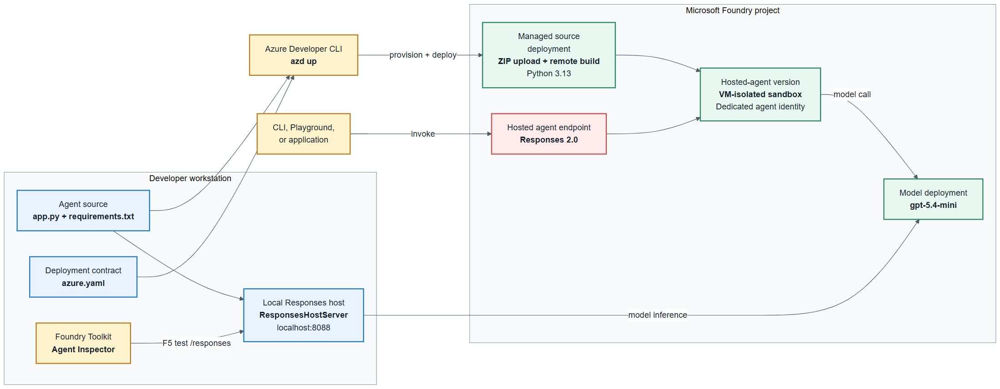

# Lab 6: Deploy a hosted agent

> **Duration:** ~20 minutes, plus an optional 10-15 minute evaluation extension

## Objective

Deploy Caldova's consumer sentiment agent directly from Python source to Microsoft Foundry Agent Service. You will inspect the Agent Framework code, verify the direct-code service configuration in `azure.yaml`, test the agent locally with the Agent Inspector, deploy it to the cloud, and validate the hosted agent.

This lab has three parts. **Part A** tests the agent locally with the Foundry Toolkit. **Part B** deploys and verifies it with `azd`. **Part C** is an optional self-paced extension that generates and runs a structured evaluation against the deployed agent.

## What is a hosted agent?

A hosted agent is your agent application running on Foundry-managed infrastructure. Unlike the scripts in Labs 3-5 that run locally, a hosted agent is a persistent, cloud-hosted service that exposes the OpenAI Responses protocol. Foundry handles the heavy lifting:

- **VM-isolated sandboxes** -- each session runs in its own isolated sandbox with a persistent filesystem.
- **REST API** -- a protocol library exposes your agent as an OpenAI Responses API endpoint, callable by the Foundry Playground, other agents, or any application.
- **Per-session scaling** -- the platform creates a sandbox on demand and tears it down when idle.
- **Dedicated agent identity** -- each agent authenticates to Foundry models and Azure services with its own Azure identity (no keys to manage).
- **Managed conversation history** -- the platform maintains continuity between turns, so your `Agent` does not need a local message list.

## Architecture

The Foundry Toolkit runs the agent locally for inspection, while `azd` packages and deploys the source to Foundry Agent Service. At runtime, the platform provisions a sandbox and exposes a dedicated endpoint that your agent uses to call Foundry models.



| Property | This lab |
|----------|----------|
| Source | `src/agent/app.py` and `src/agent/requirements.txt` |
| Runtime | Python 3.13 |
| Host adapter | `ResponsesHostServer` |
| Protocol | Responses 2.0.0 |
| Deployment | Direct code through `azure.yaml` and `azd up` |
| History | Managed by the Foundry platform |
| Identity | Azure identity; no credentials stored in source |

## Prerequisites

- The Foundry Toolkit extension installed and signed in to Azure (from Lab 1).
- Azure Developer CLI (`azd`) 1.27.1 or later.
- The Microsoft Foundry extension bundle installed with `azd ext install microsoft.foundry`.
- `.env` with `PROJECT_ENDPOINT` and `MODEL_DEPLOYMENT_NAME` set.

Install the agent dependencies (separate from the main lab requirements):

```powershell
pip install -r src/agent/requirements.txt
```

> **Note:** The `microsoft.foundry` meta-extension installs compatible `azure.ai.*` providers, including the project and hosted-agent providers used by this lab.

## Review the agent code

Open `src/agent/app.py`. The hosted agent imports the Foundry client and the Responses host:

```python
from agent_framework import Agent
from agent_framework.foundry import FoundryChatClient
from agent_framework_foundry_hosting import ResponsesHostServer
from azure.identity import DefaultAzureCredential
```

- **Connects** through `FoundryChatClient` from `agent_framework.foundry`.
- **Hosts** the agent with the Responses adapter, `ResponsesHostServer`.
- **Authenticates** without hardcoded secrets.

The `Agent` uses the Caldova sentiment instructions and disables model-side response storage:

```python
agent = Agent(
    client=FoundryChatClient(
        project_endpoint=PROJECT_ENDPOINT,
        model=MODEL_DEPLOYMENT_NAME,
        credential=DefaultAzureCredential(),
    ),
    name="caldova-consumer-sentiment-agent",
    instructions=SYSTEM_PROMPT,
    default_options={"store": False},
)
```

- **Applies** the Caldova sentiment-analysis instructions.
- **Relies** on platform-managed conversation history.
- **Prevents** duplicate response storage in the model call with `store: False`.

The entry point starts the Responses host:

```python
if __name__ == "__main__":
    ResponsesHostServer(agent).run()
```

- **Exposes** the agent through the Responses protocol expected by Foundry hosting.

### The deployment definition: azure.yaml

The root `azure.yaml` is the source of truth for the Foundry project, model deployment, and hosted agent. The `microsoft.foundry` provider provisions the project without the legacy capability-host infrastructure pattern. The agent uses direct source-code deployment with the managed Python 3.13 runtime:

```yaml
services:
  ai-project:
    host: azure.ai.project
  caldova-consumer-sentiment-agent:
    host: azure.ai.agent
    project: src/agent
    codeConfiguration:
      runtime: python_3_13
      entryPoint: app.py
      dependencyResolution: remote_build
    uses:
      - ai-project
    protocols:
      - protocol: responses
        version: 2.0.0
infra:
  provider: microsoft.foundry
```
---

## Install agent dependencies

> This step is shared by both Part A and Part B — do it once before you start.

The agent uses packages that are separate from the main lab requirements, and both deployment paths need them. Install them first:

```powershell
pip install -r src/agent/requirements.txt
```

This includes the Agent Framework hosting adapter and **debugpy** for local debugging.

---

## Part A: Test locally with the Agent Inspector

You have reviewed the agent and its deployment contract. Before creating a cloud version, run the same Python entry point locally and check its Responses endpoint through the Foundry Toolkit.

1. In VS Code, open **Run and Debug**.
2. Select **Debug Agent with Agent Inspector**.
3. Press **F5**. The configured tasks start `src/agent/app.py`, wait for port `8088`, and open the Agent Inspector.
4. Send this feedback:

   ```text
   The delivery was late, but support kept me informed.
   ```

5. Confirm that the response is one JSON object with sentiment, confidence, topics, review category, and summary fields.

The exact labels can vary, but the agent should identify both the delivery problem and the positive support experience. Stop the debugger when the check is complete.

### Local checkpoint

The Agent Inspector receives a valid JSON response and the local server reports no authentication or startup errors.

---

## Part B: Deploy and verify the hosted agent

Local testing proves the code and prompt work together. Deployment now packages the Python source, builds it remotely with the managed Python 3.13 runtime, and creates an immutable hosted-agent version.

> **Cost notice:** The following commands create or use billable Azure resources. In a managed workshop, follow your instructor's directions before running them.

From the repository root, verify the CLI and install the Foundry extension bundle:

```powershell
azd version
azd ext install microsoft.foundry
```

For the first deployment in an environment, provision the project and deploy the agent together:

```powershell
azd up
```

Later code-only changes use `azd deploy` instead. Each successful deployment creates an immutable agent version.

Check that the deployed version is active:

```powershell
azd ai agent show --output json
```

Then send one deployed smoke test:

```powershell
azd ai agent invoke caldova-consumer-sentiment-agent "The delivery was late, but support kept me informed."
```

The response should contain valid governed JSON. The `show` command also returns the Responses endpoint and a Foundry Playground URL for visual testing.

### Cloud checkpoint

The agent status is `active`, and the remote invocation returns a JSON object without storing credentials in source code.

---

## Part C: Generate an evaluation suite (optional preview)

A smoke test proves that one request works. A structured evaluation asks the same version to answer a repeatable set of tasks and uses evaluators to score whether its behavior matches the Caldova requirements.

> **Preview and cost notice:** Hosted-agent evaluation generation is in preview. Generation and evaluation make billable model calls and can take several minutes.

Generate a 15-case smoke suite from the deployed agent and the Caldova evaluation brief:

```powershell
azd ai agent eval generate `
  --agent caldova-consumer-sentiment-agent `
  --gen-instruction-file src/agent/evaluation-instructions.md `
  --eval-model gpt-5.4-mini `
  --max-samples 15 `
  --out-file eval.yaml
```

Foundry creates three reviewable assets for the agent:

- `eval.yaml`, which connects the agent, dataset, evaluators, and evaluation model.
- A synthetic dataset tuned to the agent's domain, stored beside the evaluation configuration.
- Evaluator definitions, including a rubric based on the evaluation brief, stored beside the evaluation configuration.

Open the generated files before running them. Check that the cases cover ordinary sentiment, mixed feedback, regulated review routing, valid JSON, and the prohibition on medical advice.

Run the generated evaluation:

```powershell
azd ai agent eval run --config eval.yaml
```

Review the per-evaluator scores and inspect at least one failed or borderline case. A low score is useful evidence: it identifies where the instructions, dataset, or evaluator rubric need refinement.

Because this workflow is in preview, verify what the evaluator graded before changing the agent. For JSON-format criteria, compare the rubric explanation with `sample.output_text`. If that field contains one valid JSON object but the explanation describes a list, annotations, or output-item wrapper, the evaluator graded the Responses transport envelope rather than the assistant text. Treat that score as an evaluator-input issue and refine the generated rubric to use `sample.output_text`. Upload only the corrected evaluator and rerun the same recipe:

```powershell
azd ai agent eval update --config eval.yaml --evaluator-only
azd ai agent eval run --config eval.yaml
```

Classification, routing, and summary scores remain useful signals when their explanations cite the actual assistant text.

If the refined evaluator still cites transport wrappers or marks valid `sample.output_text` as not applicable, record the schema result separately as a preview evaluator limitation. Do not use the aggregate pass rate alone to represent the agent's structured-output quality.

### Compare generated and curated coverage

Generated cases broaden coverage, but they do not replace human-reviewed expectations for regulated behavior. This repository also includes `src/agent/evals/caldova-golden.jsonl`, derived from the 15 labeled examples used earlier in the workshop.

To build an evaluation from that fixed dataset instead, generate a separate recipe:

```powershell
azd ai agent eval generate `
  --agent caldova-consumer-sentiment-agent `
  --dataset src/agent/evals/caldova-golden.jsonl `
  --gen-instruction-file src/agent/evaluation-instructions.md `
  --eval-model gpt-5.4-mini `
  --name caldova-golden-baseline `
  --out-file eval.golden.yaml
```

Keep the generated suite for exploratory coverage and the golden suite for regression testing. After changing the prompt, model, or tools, run the same golden recipe again to measure whether the new agent version improved or regressed.

### Evaluation checkpoint

You can explain the difference between a one-off invocation, an AI-generated evaluation suite, and a curated golden regression set.

**Next:** [Lab 7 - Workshop summary and learning outcomes](./lab7-summary.md)

